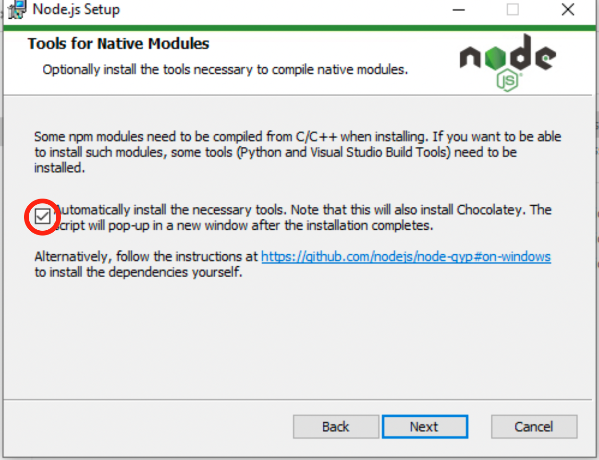

- [purpose](#purpose)
- [installation](#installation)
  - [foreword](#foreword)
  - [create a virtualenv](#create-a-virtualenv)
  - [install Python requirements](#install-python-requirements)
  - [install `npm`](#install-npm)
    - [Windows and MacOS](#windows-and-macos)
    - [Linux](#linux)
  - [install the JavaScript kernel for Jupyter](#install-the-javascript-kernel-for-jupyter)
  - [enable jupyter extensions](#enable-jupyter-extensions)
  - [read the course](#read-the-course)


# purpose

this repo contains a very short introduction course on the 3 Web pillars : HTML CSS and JavaScript

# installation

as usual the course can be run on nbhosting; if you want to  to read it locally
on your computer, do the following


## foreword

* **PREREQUISITES**  
  the instructions below assume you have installed the common stack used for the
  S1 courses, namely `miniconda` + `bash` + `git` + `vs-code`
* **WARNING**  
  note that on Windows, the installation instructions below involve the
  installation of some Visual-Studio components, which is a little intrusive and
  take a looonng time...

## create a virtualenv

recommended, but optional

```
conda create -n web-intro python=3.9
conda activate web-intro
```

## install Python requirements

```
# like always
pip install -r requirements.txt
```

## install `npm`

we need `npm` to install the JavaScript kernel for Jupyter;
there are numerous ways to install this, they all depend on your platform (see below)

in any case, once done, check your installation with

```bash
npm --version
```

### Windows and MacOS

* use node's native installer from <https://nodejs.org/en/> - make sure to use the LTS one (long time support)
* also make sure to click the tick box as shown below



### Linux

use your platform's native package manager

* redhat / fedora / centos

  ```bash
  dnf install npm
  ```

* ubuntu / debian

  ```bash
  apt update
  apt install npm
  ```

## install the JavaScript kernel for Jupyter

```
npm install -g ijavascript
ijsinstall
# On some windows environment, if this does not work, you may try: %appdata%\npm\ijsinstall
```

## enable jupyter extensions

it is important to have the `hide_input` extension active

```
jupyter contrib nbextension install --user
jupyter nbextension enable hide_input/main
```

## read the course

```
# the usual
jupyter notebook
```
