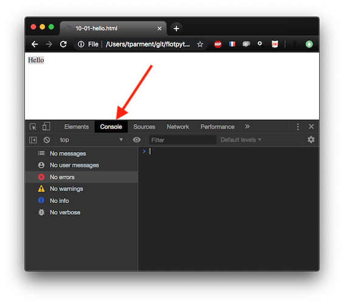
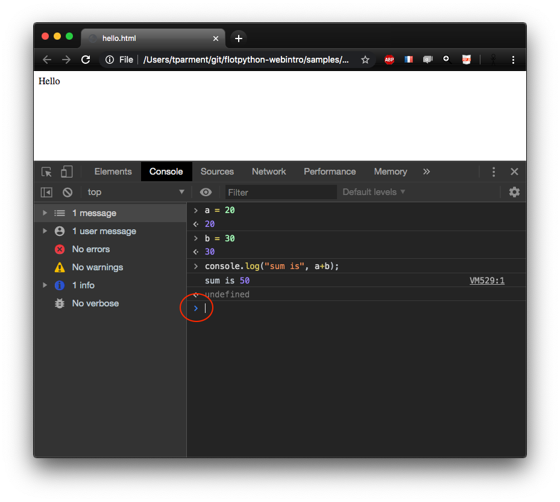
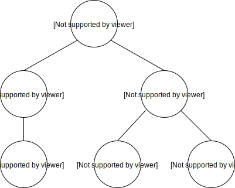

<div class="licence">
<span>Licence CC BY-NC-ND</span>
<span>Thierry Parmentelat</span>
</div>

+++ {"slideshow": {"slide_type": ""}}

# HTML basics

+++

bien évaluer cette cellule avant de lire le notebook

```{code-cell}
 // this line is to force a reload
delete require.cache[require.resolve('../js/toolsv3')]
tools = require('../js/toolsv3')
tools.init()
```

+++ {"slideshow": {"slide_type": "slide"}}

## HTML is based on tags

+++

the HTML language structures the content of a web page
in terms of sections, headers, paragraphs, lists of items, images ...

the language is based on tags written between `<` and `>`  
for example <code>&lt;head&gt;</code>

an element (a section, a header) is composed by

* an opening tag e.g. <code>&lt;head&gt;</code>
* a content that can be empty
* a closing tag e.g. <code>&lt;/head&gt;</code>

+++ {"slideshow": {"slide_type": "slide"}}

## HTML document structure

+++ {"hide_input": true}

the overall structure of a HTML document is composed of two parts, a **header** and a **body**, like this:

```{code-cell}
:hide_input: true

fragment1 = `<html>
  <head>
     <!-- various document-wide declarations -->
  </head>
  <body>
     <!-- the actual document contents -->
     Hello
  </body>
</html>`

tools.sample_from_strings({html: fragment1}, {separate_show: false})
```

+++ {"slideshow": {"slide_type": "slide"}}

## browser and server

+++ {"slideshow": {"slide_type": ""}, "cell_style": "split"}

### regular setup

files are on the Internet


+++ {"slideshow": {"slide_type": ""}, "cell_style": "split"}

### our setup today

files are local on your laptop


+++

<div class="rise-footnote">
for your first practice, you will save your code on your hard drive, and check the result locally <br> 
without the presence of a server, this is what the <code>file://</code> URLs are for
</div>

+++ {"slideshow": {"slide_type": "slide"}}

## practice

+++ {"slideshow": {"slide_type": ""}}

* start from an empty folder
* open vs-code and create a file named `hello.html`  
* copy the above template
* open it in your web browser (preferably Chrome)
  * often you can simply double-click in the file explorer
  * or use the *File → Open File* menu
  * or directly type a URL like  
    `file:///the/complete/path/to/hello.html`
* you will see something like shown on the next slide

+++ {"hide_input": false, "slideshow": {"slide_type": "slide"}, "cell_style": "split"}

your `hello.html` should look like this

+++ {"cell_style": "split"}

and in the browser  
it will look like this

```{code-cell}
:hide_input: true

// need to set an id as the default is to hash the html content
// and we will reuse this later down the page
tools.sample_from_strings(
    {html: fragment1},
    {id: 'fragment1', height: '12em', separate_show: false})
```

<p class="rise-footnote">also observe the URL that the browser has used to fetch your file <br>
    it should look like <code>file:///the/path/to/your/current/directory/hello.html</code> </p>

+++ {"slideshow": {"slide_type": "slide"}}

## accessing your browser's devel tools

+++ {"cell_style": "split"}

* all browsers come with development tools for debugging
* as a first contact with these,  
  let us inspect the content of our HTML document
* for that, the simplest way is to right-click on the 'Hello' text
* and choose 'Inspect'

+++ {"slideshow": {"slide_type": ""}, "cell_style": "split"}


+++ {"slideshow": {"slide_type": ""}, "cell_style": "split"}

<p class="rise-footnote"> 
  this should open your browser's devel tools, which depending on your browser
    <br> may require additional preparation or  installation steps
    <br> we recommend using Chrome in case it is not working as expected 
</p>

+++ {"slideshow": {"slide_type": "slide"}}

## check for devel tools

+++

* if you cannot see the devel tools (see next slide for a glimpse)
  it means your browser may need additional installation (google for how to do that)

* here's how to check your browser (all this on mac at least)

 * on Safari: you should have a ***Develop*** menu in the main menubar:  
    * *File Edit View History Bookmarks **Develop** Window*
 * on Chrome: you should have a ***Developer*** submenu  
   in the *View* menu in the main menubar
 * on Firefox: you should have a ***Web Developer*** entry  
   in the *Tools* menu in the main menubar

+++ {"slideshow": {"slide_type": "slide"}}

## *Elements* navigator

+++ {"slideshow": {"slide_type": ""}, "cell_style": "split"}


+++ {"cell_style": "split"}

* left pane, navigate the elements
* right pane, visualize the  
  selected element's applicable  
  *Styles* and *Computed* properties  
  (more on this later)

+++ {"slideshow": {"slide_type": ""}}

<p class="rise-footnote"> 
from that view you can navigate the elements tree, although in this case it is very simple, with just 3 nodes
</p>

+++ {"slideshow": {"slide_type": "slide"}, "cell_style": "split"}

* another interesting part is the   
(JavaScript) *Console* tab  
* this is where **debug messages**  
  end up (if any; here of course  
  there are none)

+++ {"slideshow": {"slide_type": ""}, "cell_style": "split"}



+++ {"cell_style": "split", "slideshow": {"slide_type": "slide"}}

* the area with the `> ` is the REPL  
  i.e. Read, Eval, Print Loop
* (juste like the `>>> ` with Python)


where you can type and run 
your first JavaScript code

+++ {"cell_style": "split"}



+++ {"slideshow": {"slide_type": "slide"}}

## DOM = Document Object Model

+++ {"slideshow": {"slide_type": ""}}

* the `<tag> ... </tag>` notation 
* unambiguously maps to a tree structure  
  known as an Abstract Syntax Tree (AST)
* referred to in all documentation as "*the DOM* "

+++ {"cell_style": "split", "slideshow": {"slide_type": "slide"}}

this HTML fragment
```html
<html>
 <head>
  <title>top title</title>
 </head>
 <body>
  <p>a paragraph</p>
  <p>a paragraph</p>
 </body>
</html>
```

+++ {"cell_style": "split", "hide_input": true}

will result in this tree


+++ {"cell_style": "center"}

nodes in this tree are called **Elements**  
it is the basis for navigating the document  
in the *Elements* devel tools tab

+++ {"slideshow": {"slide_type": "slide"}}

## be rigourous

+++ {"slideshow": {"slide_type": ""}}

* browsers tend to be as tolerant as possible
* e.g. omitting a closing tag may render just fine
* **however** there's only so much that can be guessed
* and this may cause **huge headaches** down the road
* so make sure to **always *close your tags* properly**

+++ {"slideshow": {"slide_type": "slide"}, "tags": []}

**do not do this !!**

```{code-cell}
:hide_input: true
:tags: [raises-exception]

fragment_unclosed = `<p> do not do this
<ul>
<li> unclosed tags <b>look like</b> they work
<li> but they will hurt eventually
`

tools.sample_from_strings({html: fragment_unclosed}, {separate_show: false, width: '40em'})
```

+++ {"tags": [], "slideshow": {"slide_type": "slide"}}

**do this instead**

```{code-cell}
:hide_input: true

fragment_closed = `<p> do this instead </p>
<ul>
<li> always close your tags </li>
<li> clean up behind yourself </li>
</ul>
`

tools.sample_from_strings({html: fragment_closed}, {separate_show: false})
```

+++ {"slideshow": {"slide_type": "slide"}}

## a few tips

+++

* vs-code has great support for editing `html` documents
  * even with no extension installed
  * [see e.g. this page for details](https://code.visualstudio.com/docs/languages/html)
  * and [in particular emmet snippets](https://code.visualstudio.com/docs/languages/html#_emmet-snippets)
* you often need to switch from editor to browser and back
  * use keyboard shortcuts to switch between apps
  * typically with `⌘-tab` (or alt-tab or control-tab depending on your environment)
* also make sure to know the keyboard shortcut  
  for your browser to reload a page
  * typically `⌘-r` (or 'ctrl-r' ...)
