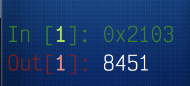
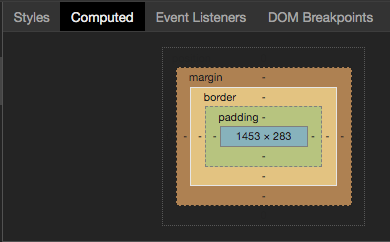
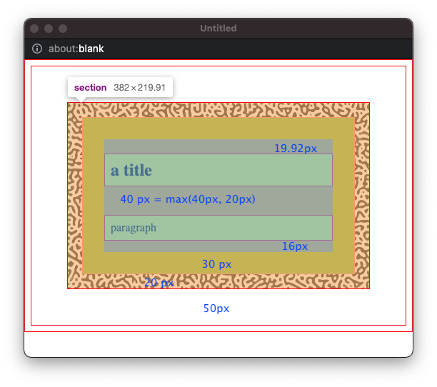

Licence CC BY-NC-ND, Thierry Parmentelat

+++ {"slideshow": {"slide_type": ""}}

# CSS main properties

```{code-cell}
tools = require('../js/tools'); tools.init()
```

+++ {"slideshow": {"slide_type": "slide"}}

## too many to be listed

+++

* more than 100 properties defined  
  in the standard ([see full list here](https://www.w3schools.com/cssref/))

* we just mention the most obviously needed

+++ {"slideshow": {"slide_type": "slide"}}

## text properties

```{code-cell}
---
cell_style: center
hide_input: true
slideshow:
  slide_type: ''
tags: [hide_input]
---
text_html = `<p class="text">
a sample text</p>`;
text_css = `.text {
    font-family: times;
    font-size: 30px;
    font-weight: bold;
    font-style: italic;
    text-decoration: underline;
}
`;
tools.sample_from_strings({html: text_html, css: text_css})
```

+++ {"slideshow": {"slide_type": "slide"}}

## many fonts available

+++

* see for example [a collection of google fonts](https://fonts.google.com/)
* note also some less traditional fonts
  * that come with usual symbols
  * see [in particular *fontawesome*](https://fontawesome.com/icons?d=gallery&m=free)  
    who offer a decent collection for free

the example below illustrates how to load and use them in your page

```{code-cell}
---
hide_input: true
slideshow:
  slide_type: slide
tags: [hide_input]
---
tools.sample_from_stem("../samples/15-font-demo")
```

+++ {"slideshow": {"slide_type": "slide"}}

### notes on the fonts example (1)

+++ {"slideshow": {"slide_type": ""}}

* for cosmetic reasons, the example is a bit simplified  
  use something like this to import a font  
  in all variants of bold/italic

```html
<link rel="stylesheet"
      href="https://fonts.googleapis.com/css?family=Raleway:200,200i,400,400i,500,500i,600,600i,700,700i">
```

+++ {"slideshow": {"slide_type": "slide"}}

### notes on the fonts example (2)

+++ {"slideshow": {"slide_type": ""}}

* the single CSS rule here allows to apply  
  the font **to the whole document**  
  we will see in a moment how that actually works  

* btw, it is strongly recommended to avoid  
  mixing fonts in a document

+++ {"slideshow": {"slide_type": "slide"}}

### notes on the fonts example (3)

+++ {"slideshow": {"slide_type": ""}}

* also observe the import and use of *fontawesome*  
  to display custom symbols before address and phone number, like  

  ```html
  <span class="fas fa-mobile-alt">
  ```
  that I [found in this page](https://fontawesome.com/v5.15/icons/mobile-alt?style=solid) after browsing [the fontawesome catalog](https://fontawesome.com/v5.15/icons)

* these symbols are more convenient than bitmap pictures  
  in particular can be safely scaled / colorized
  using CSS

+++ {"slideshow": {"slide_type": "slide"}}

## Unicode characters

+++

* also remember there are more than 140.000 characters defined in the Unicode standard; so without the need to switch to another font, you can just write things like these  
  ︙→ ⇀ « » ❯ × ∑ ∀α ∃ε ∈ x² © …

* being part of a text, these can also be safely styled  
  i.e. scaled, coloured&hellip;  
  as opposed, again, to using bitmap pictures

```{code-cell}
:hide_input: true
:tags: [hide_input]

tools.sample_from_strings({
    html : `<div>
︙→ ⇀ « » ❯ × ∑ ∀α ∃ε ∈ x² © …
<div>`
    ,
    css : `div {
    color:blue;
    background-color: gray;
    font-size: 20px;
    display: flex;
    justify-content: center;
    padding: 20px;
}`}, {
  start_with: 'css'
})
```

+++ {"slideshow": {"slide_type": "slide"}, "cell_style": "split"}

### Unicode - the easy way

+++ {"slideshow": {"slide_type": ""}, "cell_style": "split"}

if you need to insert e.g. the ℃
symbol, you can do it several ways :

easiest way : just cut-and-paste it right into the html as-is  
(provided that your html file is utf8-encoded)

+++ {"slideshow": {"slide_type": "slide"}, "cell_style": "split", "tags": ["level_intermediate"]}

### Unicode - the less easy way

+++ {"slideshow": {"slide_type": ""}, "cell_style": "split"}

each Unicode character has a unique codepoint

you can use that in a pure-ASCII source, and  write either

* `&#8451;` (decimal) or
* `&#x2103;`  
  the `x` stands for hexa

+++ {"cell_style": "split"}


+++ {"cell_style": "split"}



+++ {"slideshow": {"slide_type": "slide"}, "tags": ["level_intermediate"]}

### Unicode - epilogue

+++

some characters can be inserted with the same `&...;` notation using nicknames instead of a codepoint, examples

* `&lt;` for &lt; and `&gt;` for &gt;  
  sometimes useful to actually insert brackets like in &lt;code&gt;

* `&nbsp;` for a non-breaking&nbsp;space
  which is more explicit/readable

* `&hellip;` for &hellip;

+++ {"slideshow": {"slide_type": "slide"}}

## the box model

+++

each visible element can be styled according to the box model,  
as shown in the browser devel tools

+++ {"cell_style": "split"}



+++ {"cell_style": "split", "slideshow": {"slide_type": ""}}

* padding is **inside the border**
* margin is **outside the border**

+++ {"slideshow": {"slide_type": "slide"}}

## atomic properties (1)

+++

each side (top, right, bottom, left) of the box  
has its own individual properties  
here e.g. padding and border

click on 'Open in new window' and use inspector on the `<p>` element

```{code-cell}
:hide_input: true
:tags: [hide_input]

box1_html = `<p class="box1">
a box
</p>`

box1_css = `p.box1 {
    font-size: x-large;
    background-color: #ccc;

    padding-top: 10px;
    padding-right: 20px;
    padding-bottom: 5px;
    padding-left: 40px;

    border-bottom-width: 5px;
    border-bottom-color: black;
    border-bottom-style: solid;
}`

tools.sample_from_strings({html: box1_html, css: box1_css}, { start_with: 'css' })
```

+++ {"slideshow": {"slide_type": "slide"}}

### atomic properties (2)

+++ {"hide_input": true}

again with also margin and border-radius

```{code-cell}
:hide_input: true
:tags: [hide_input]

box2_html = `<p class="box2">
a second box
</p>`

box2_css = `p.box2 {
    font-size: x-large;

    background-color: #ccc;

    padding-left: 40px;
    padding-top: 10px;

    margin-left: 20px;
    margin-top: 30px;

    border-top-width: 5px;
    border-top-color: black;
    border-top-style: solid;

    border-left-width: 10px;
    border-left-color: red;
    border-left-style: solid;

    border-top-left-radius: 5px;
}`

tools.sample_from_strings({html: box2_html, css: box2_css}, { start_with: 'css' })
```

+++ {"slideshow": {"slide_type": "slide"}}

## shorthand properties

+++

of course this can become quite tedious,  
so there also are so-called *shorthand properties*  
for dealing with paddings, margins, borders and fonts, among others  
that allow to set **several** atomic properties in one line

+++ {"slideshow": {"slide_type": "slide"}}

### shorthand order

+++ {"slideshow": {"slide_type": ""}, "cell_style": "split"}

the trick is to remember this figure

+++ {"slideshow": {"slide_type": ""}, "cell_style": "split"}


+++

* `padding: 10px 20px 30px 40px` will assign the 4 padding properties in the order above
* `padding: 10px;` will set all 4 *padding* properties
* `margin: 10px 20px` will set top *and bottom* to `10px`, and *both* sides to `20px`

+++ {"slideshow": {"slide_type": "slide"}}

### more shorthands

same kind of shorthands are available for

* `font: xxx` [see details here](https://developer.mozilla.org/en-US/docs/Web/CSS/Shorthand_properties#font_properties)
* `border: xxx` [see details here](https://developer.mozilla.org/en-US/docs/Web/CSS/Shorthand_properties#background_properties)
* for a more complete list, [see this page on MDN](https://developer.mozilla.org/en-US/docs/Web/CSS/Shorthand_properties)

+++ {"slideshow": {"slide_type": "slide"}}

### shorthand example

+++

use the inspector from the devel tools to check the individual properties of the `<p>` elt, e.g. the `padding`

```{code-cell}
:hide_input: true
:tags: [hide_input]

shorthand_html = `<p class="shorthand1">
shorthand properties
</p>
`

shorthand_css = `p.shorthand1 {
    font: italic bold 20pt Arial, sans-serif;
    margin: 40px;
    padding: 30px 90px;
    border: 2px solid green;
    border-radius: 10px;
}`;
tools.sample_from_strings({html: shorthand_html, css: shorthand_css}, {start_with: 'css'})
```

+++ {"slideshow": {"slide_type": "slide"}}

## unit lengths

+++

a great many deal of units are available to express lengths  
[see more details on this page](https://css-tricks.com/the-lengths-of-css/) , e.g. :

* `10px`
* `1in`, `2.54cm`, `25mm`
* `20pt` (1pt = 1/72 inch)
* `2em`, `1ex`, `20ch`, relative to current font size
* `80%` typically for width and height, relative to parent element

+++ {"slideshow": {"slide_type": "slide"}}

## colors

+++

several formats are supported to describe a color :

* common colors by name, like `red` ([see full list](https://www.w3schools.com/colors/colors_names.asp))
* RGB components like `#8000ff` that means
  * red = 0x80 = 128, green = 0x00 = 0, blue = 0xff = 255
  * all three of course are in the [0-255] range
* same in decimal:
  * `rgb(128, 0, 255)`
* opacity (in the [0-1.] range can be given as a fourth argument
  * `rgb(128, 0, 255, 0.2)` will be only 20% opaque, i.e. almost transparent

+++ {"slideshow": {"slide_type": "slide"}}

### colors: online resources

* like always, many online sites can help pick a decent color palette
* personnally I like this one  
  https://colorhunt.co/palette

+++ {"slideshow": {"slide_type": ""}}

<div class="note">

note that on colorhunt you can copy a color code by just clicking it

</div>

+++ {"slideshow": {"slide_type": "slide"}}

## `box-sizing`

+++

the `box-sizing` property affects the way `width` and `height` properties are computed:

* `box-sizing: content-box` : only take content into account
* `box-sizing: padding-box` : account for content + padding
* `box-sizing: border-box` : content + padding + border

margins are **always excluded**

+++ {"slideshow": {"slide_type": "slide"}}

## `box-sizing` (continued)

+++

not often needed, but typical use case is

* you want a given component to take 500px **in total**
* so the borders and paddings *push content inside*
* then use `box-sizing: border-box`

see also https://css-tricks.com/box-sizing/
that has a live demo

+++ {"slideshow": {"slide_type": "slide"}}

## `background`

+++

there are 8 elementary properties that make an element's background

* `background-image`
* `background-position`
* `background-size`
* `background-repeat`
* `background-attachment`
* `background-origin`
* `background-clip`
* `background-color`

+++ {"slideshow": {"slide_type": "slide"}}

## `background` (continued)

+++

most often this is set through a unique shorthand property `background`

https://css-tricks.com/almanac/properties/b/background/

+++

also note that background

* does cover the **padding area**
* but **not** the margin area
* that is thus essentially transparent
* and styled by parent

+++ {"slideshow": {"slide_type": "slide"}}

## `background` and margins (demo)

```{code-cell}
:hide_input: true
:tags: [hide_input]

background_html = `<div>
  <section>
      <h1> a title </h1>
      <p> paragraph </p>
   </section>
</div>
`

background_css = `* {
    border: 1px solid red;
}
div {
    background: url(media/texture.png);
    margin: 50px;
}
section {
    margin: 20px;
    padding: 30px;
    background: orange;
}
h1, p {
    padding: 8px;
    background-color: yellow;
}
h1 {
    margin-bottom: 40px;
}
p {
    margin-top: 20px;
}
`

tools.sample_from_strings({html: background_html, css: background_css})
```

+++ {"slideshow": {"slide_type": "slide"}}

## `background` and margins - demo explained



+++ {"hide_input": true}

<div class="note">

use the inspector to see how the space between the two and observe:  
how the margin space gets filled by the parent  
how the space between inner borders (h1 and p)  
is actually the <b><i>max</i></b> of their margins  
how the 2 other margins (the title's top-margin and the paragrapgh's bottom margin)  
are inherited from the default user agent stylesheet (here this is chrome)

</div>
