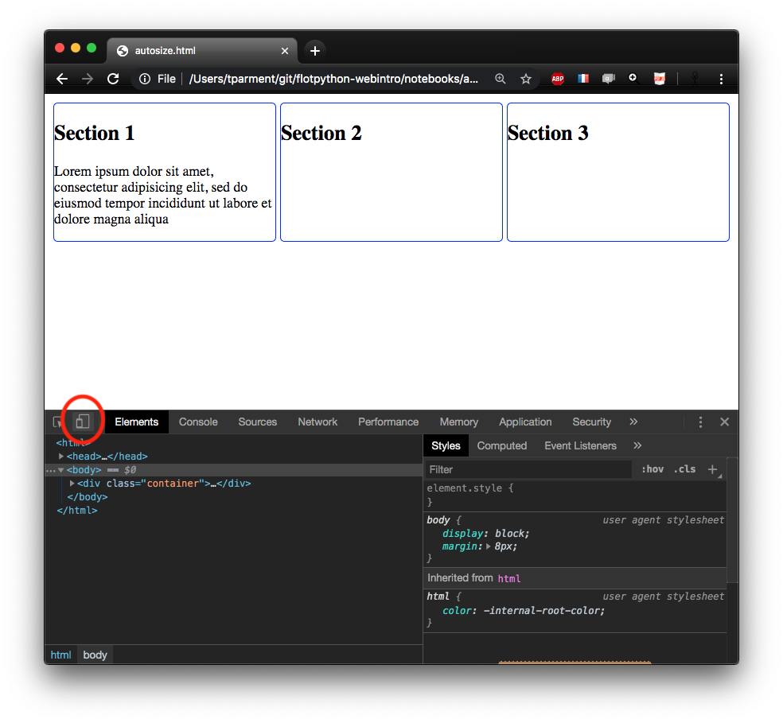
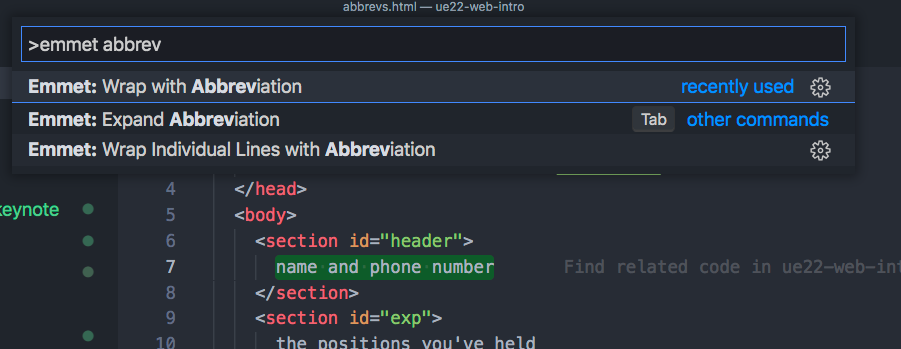
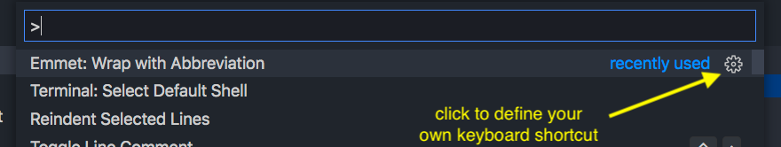
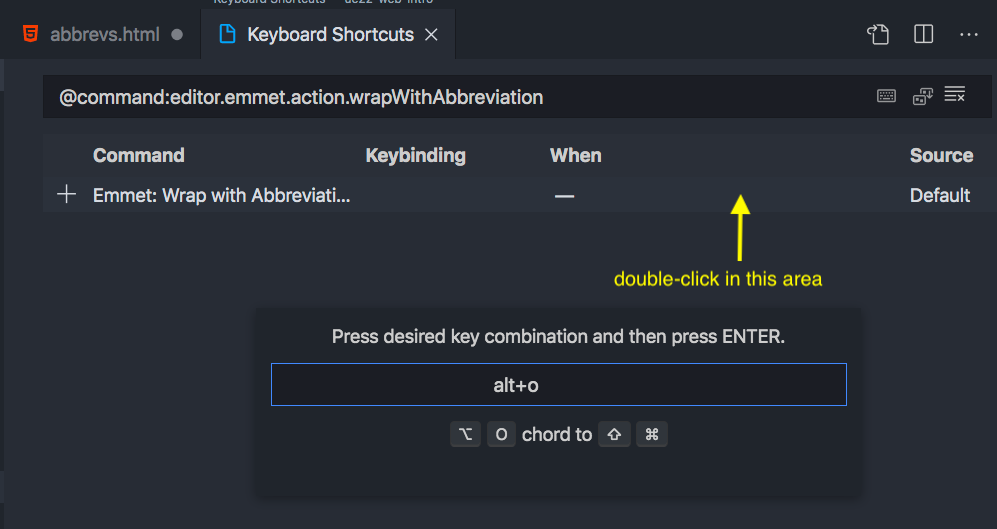

---
jupytext:
  cell_metadata_filter: all,-hidden,-heading_collapsed,-run_control,-trusted
  formats: md:myst
  notebook_metadata_filter: all,-language_info,-toc,-jupytext.text_representation.jupytext_version,-jupytext.text_representation.format_version
  text_representation:
    extension: .md
    format_name: myst
kernelspec:
  display_name: JavaScript (Node.js)
  language: javascript
  name: javascript
nbhosting:
  title: grid layout
rise:
  autolaunch: true
  slideNumber: c/t
  start_slideshow_at: selected
  theme: sky
  transition: cube
---

Licence CC BY-NC-ND, Thierry Parmentelat

+++ {"slideshow": {"slide_type": ""}}

# `display: grid`

```{code-cell}
tools = require('../js/tools'); tools.init()
```

+++ {"slideshow": {"slide_type": "slide"}}

## purpose

+++

* create grid-based layouts, obviously
* historically a challenging task
  * the `<table>` tag has long been overused  
    to address that sort of needs

  * twitter's `bootstrap` has been used for this too at some point
  * **do not use** these tools for that in 202x !
  
* `grid` is now available in [all popular modern browsers](https://caniuse.com/#feat=css-grid)

+++ {"slideshow": {"slide_type": "slide"}}

## example (1)

+++ {"cell_style": "split"}

next slide demontrates this CSS:

+++ {"cell_style": "split"}


+++ {"cell_style": "center"}

* a proportional grid of [3 rows ⨉ 4 columns]
* with 4 areas defined, based on that tiling  
  `header`, `main`, `sidebar`, and `footer`

* and 4 `<div>`s that are mapped on these areas  
  *e.g.*  `grid-area: header`

```{code-cell}
---
hide_input: true
slideshow:
  slide_type: slide
tags: [hide-input]
---
grid_html = `<div class="container">
  <div id="item-a">
    the header<br>blabla
  </div>
  <div id="item-b">
    main area<br>blabla<br>blabla
  </div>
  <div id="item-c">
    side bar<br>blabla
  </div>
  <div id="item-d">
    a footer<br>blabla
  </div>
</div>`

grid1_css = `.container {
  display: grid;
  grid-template-columns:
    1fr 1fr 1fr 1fr;
  grid-template-areas:
    "header header header header"
    "main   main   .      sidebar"
    "footer footer footer sidebar";
}

#item-a {
    grid-area: header;
    background-color: #ffba5a;
}
#item-b {
    grid-area: main;
    background-color: #3282b8;
}
#item-c {
    grid-area: sidebar;
    background-color: #db3056;
}
#item-d {
    grid-area: footer;
    background-color: #7fa998;
}`
tools.sample_from_strings({html: grid_html, css: grid1_css}, {id: 'grid-1', start_with: 'css'})
```

+++ {"cell_style": "split", "slideshow": {"slide_type": "slide"}}

* note the usage of a  
  *grid-specific* length unit :

+++ {"cell_style": "split"}


+++ {"cell_style": "center", "slideshow": {"slide_type": ""}}

  * `fr` stands for 'free space'
  * so we can allocate fixed or proportional space  
    to some columns (or rows, for that matter)

  * and split the rest proportionally

+++

<div class="note">

on this specific example, we could have omitted `grid-template-columns` altogether

</div>

+++ {"slideshow": {"slide_type": "slide"}}

## example (2)

+++ {"hide_input": true}

mostly the same, but :

* we can specify fixed size for some columns
* only change is to replace
  * `grid-template-columns: 1fr 1fr 1fr 1fr` with
  * `grid-template-rows: 100px 1fr 5% 1fr;`

+++ {"hide_input": true}

<div class="note">

**btw** we could have written `repeat(4, 1fr)` instead of `1fr 1fr 1fr 1fr`

</div>

```{code-cell}
---
hide_input: true
slideshow:
  slide_type: slide
tags: [hide-input]
---
grid2_css = `.container {
  display: grid;
  grid-template-columns:
    100px 1fr 5% 1fr;
  grid-template-areas:
    "header header header header"
    "main   main   .      sidebar"
    "footer footer footer footer";
}

#item-a {
    grid-area: header;
    background-color: #ffba5a;
}
#item-b {
    grid-area: main;
    background-color: #3282b8;
}
#item-c {
    grid-area: sidebar;
    background-color: #db3056;
}
#item-d {
    grid-area: footer;
    background-color: #7fa998;
}`

tools.sample_from_strings({html: grid_html, css: grid2_css}, {id: 'grid-2', start_with: 'css'})
```

+++ {"slideshow": {"slide_type": "slide"}}

## example (3)

+++ {"hide_input": true}

in the previous examples :

* we have **not imposed** anything on **the height** of the result
* each box gets its height based on its content

* it is also possible - although less often needed  
  to fix a height globally and arrange the rows accordingly

* only change is to add on the grid:
  * `height: 100vh` to say we want to use all viewport height
  * `grid-template-rows: 50px 1fr 100px;`  
    which specifies how to use vertical space

```{code-cell}
---
hide_input: true
slideshow:
  slide_type: slide
tags: [hide-input]
---
grid3_css = `.container {
  display: grid;
  grid-template-columns: 1fr 1fr 1fr 1fr;
  grid-template-areas:
    "header header header header"
    "main main . sidebar"
    "footer footer footer footer";
  grid-template-rows: 50px 1fr 100px;
  height: 100vh;
}

#item-a {
    grid-area: header;
    background-color: #ffba5a;
}
#item-b {
    grid-area: main;
    background-color: #3282b8;
}
#item-c {
    grid-area: sidebar;
    background-color: #db3056;
}
#item-d {
    grid-area: footer;
    background-color: #7fa998;
}
`
tools.sample_from_strings({html: grid_html, css: grid3_css}, {start_with: 'css'})
```

+++ {"slideshow": {"slide_type": "slide"}}

## and much more…

+++

* a very good introduction to Grids  
  [can be found on css-tricks.com](https://css-tricks.com/snippets/css/complete-guide-grid/)

* with many illustrations and examples

+++

### assignment

+++

* **strongly recommended**
  * to **bookmark that page**
  * and browse it (but entirely)  
    to get a grip of what's achievable

+++

<div class="note">

you may also complete this game  <https://cssgridgarden.com/> at home if you feel like it

</div>

+++ {"slideshow": {"slide_type": "slide"}, "tags": ["level_intermediate"]}

## auto-sizing

+++ {"cell_style": "split", "tags": ["level_intermediate"]}

* a nice feature of grid display
* is its ability to auto-organize the grid
* using an idiom based on
  * `repeat`
  * `auto-fit`
  * `minmax`

+++ {"cell_style": "split", "tags": ["level_intermediate"]}

* that we illustrate in the next example  
* see [this doc about minmax()](https://developer.mozilla.org/en-US/docs/Web/CSS/minmax)
* see also [this blogpost on css-tricks.com](https://css-tricks.com/auto-sizing-columns-css-grid-auto-fill-vs-auto-fit/)

+++ {"slideshow": {"slide_type": "slide"}, "tags": ["level_intermediate"]}

## auto-sizing example

```{code-cell}
:hide_input: true
:tags: [level_intermediate, hide-input]

autosize_html = `<div class="container">
  <section>
    <h1>Section 1</h1>
    <p>Here we say that we want 3 same-width
       columns in the viewport width,
       provided that they are at least 250px wide.
    </p>
  </section>
  <section>
    <h1>Section 2</h1>
    <p>It all plays best in a new window
       that you can resize at will.
    </p>
  </section>
  <section>
    <h1>Section 3</h1>
  </section>
</div>`

autosize_css = `section {
  border: 1px solid blue;
  border-radius: 5px;
  margin: 2px;
}

.container {
  display: grid;
  grid-template-columns:
    repeat(auto-fit, minmax(250px, 1fr));
}`

tools.sample_from_strings({html: autosize_html, css: autosize_css}, {start_with: 'css'})
```

+++ {"slideshow": {"slide_type": "slide"}}

## devel tools and multi-device

+++

* the devel tools - on chrome at least
* allow to simulate other devices
* like popular phones and tablets

+++ {"slideshow": {"slide_type": "slide"}}



+++ {"slideshow": {"slide_type": "slide"}}


+++ {"slideshow": {"slide_type": "slide"}}

## other tricks

+++

when using these technologies, you are often in a position to **add wrapping tags** in your html

to do this easily under vs-code :

* select the text you want to wrap
* enter the palette - the swiss knife in vs-code  
  (mac: ⌘-⇧-p - Windows ⌃-⇧-p - in doubt, ask google)

* type `Emmet wrap with abbreviation`
* enter the tag name

+++

it is easy to bind a keyboard shortcut to functions that you use often

+++ {"slideshow": {"slide_type": "slide"}}

if you need to add a wrapping `<div>` / `</div>` around some text, select it


+++ {"slideshow": {"slide_type": "slide"}}



+++ {"slideshow": {"slide_type": "slide"}}

then activate the palette and search for 'emmet: wrap with abbreviation'

select that function, you will be prompted for the name of the wrapping tag


+++ {"slideshow": {"slide_type": "slide"}}

it is rather straightforward to attach a custom keybinding to that function if you use it often



+++ {"slideshow": {"slide_type": "slide"}}

for example here, for now we can type 'Alt-o' to call that function


