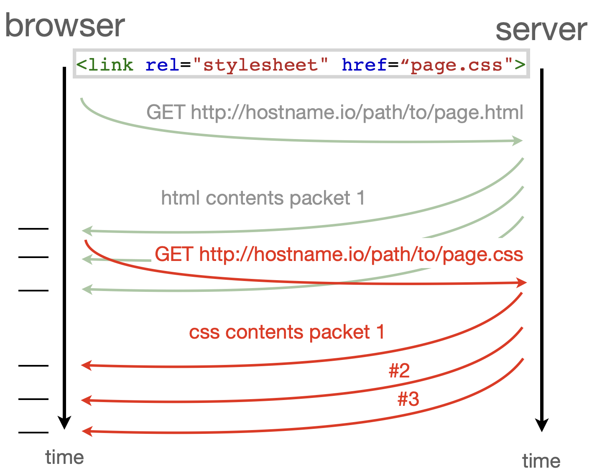
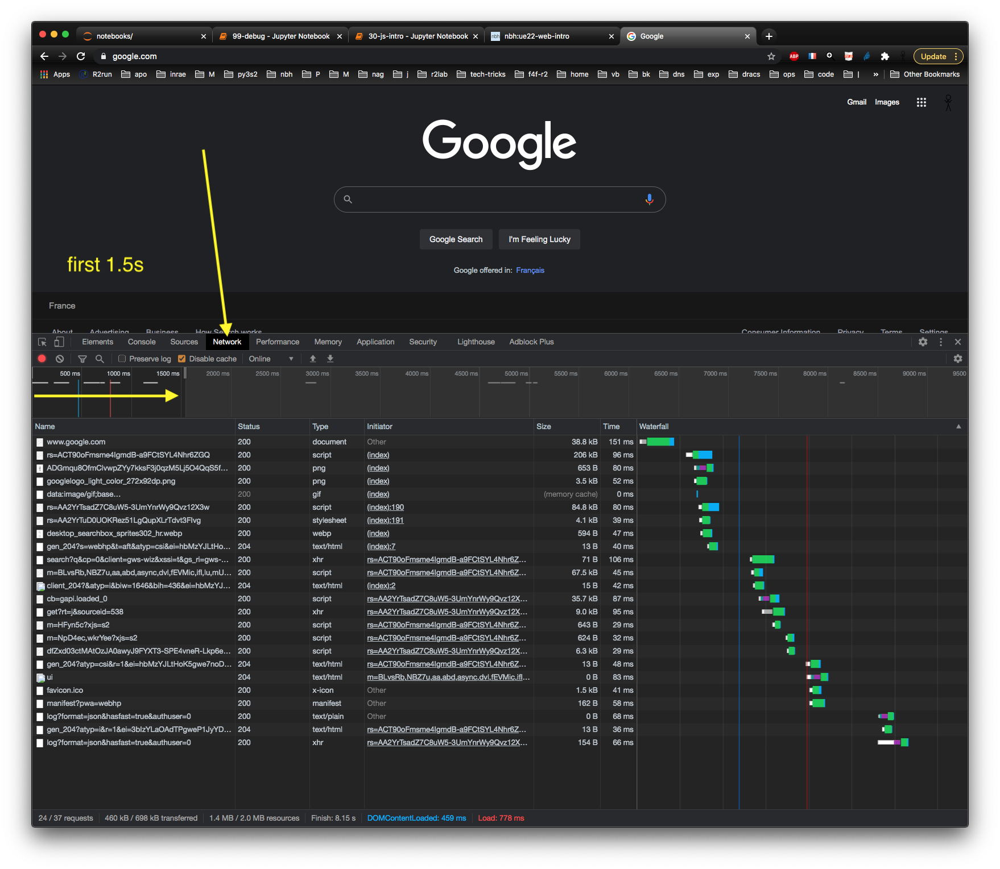

Licence CC BY-NC-ND, Thierry Parmentelat

+++ {"slideshow": {"slide_type": ""}}

# JavaScript by examples

```{code-cell}
tools = require('../js/tools'); tools.init()
```

+++ {"slideshow": {"slide_type": "slide"}}

## why JavaScript

+++

JavaScript comes in addition to

* HTML for **content**
* CSS for **style**

JavaScript

* it is a full-fledged **programming language**
* and provides for **behaviour**

+++ {"slideshow": {"slide_type": "slide"}}

## JavaScript characteristics

+++

* runs **inside the browser**(♡)
* has direct **access to the DOM**
* so it can freely **manipulate the HTML**  
* in order to add / remove / **modify content**  
* and/or dynamically **change properties**
* in response to e.g. **user-triggered events**

+++

<div class="note">

(♡) as mentioned earlier, one can also write "regular" programs in JS using the *node.js* &nbsp;runtime

</div>

+++ {"slideshow": {"slide_type": "slide"}}

## page loading - asynchronism

+++

### reminder : a few orders of magnitude

* CPU + memory : 1 ns
* storage :
  * SDD : 100 µs
  * HDD : 1-10 ms
* networking :
  * light-speed Paris-SF : 30 ms
  * light-speed Paris-Nice : 3 ms
  * plus, software stack traversals
  * plus, protocols = several back and forths
  * bottom line: more in the **several 100s of ms**
  * frequently several seconds

+++ {"slideshow": {"slide_type": "slide"}}

### a simple page

+++ {"cell_style": "split"}

when loading the simplest possible page, contents get scattered into packets, so it does not arrive all at once

+++ {"cell_style": "split"}


+++ {"slideshow": {"slide_type": "slide"}}

### a page and a nested page

+++ {"cell_style": "split"}

in the case of a page  
that has **a nested page**  
(e.g. a CSS style)  
there are 2 http requests at work

+++ {"cell_style": "split"}



+++ {"slideshow": {"slide_type": "slide"}}

### loading a real page

+++

Devel Tools can visualize the actual loading workflow

+++



+++ {"slideshow": {"slide_type": "slide"}}

## JS loading - howto

### open topic

+++

* loading javascript is a bit tricky  
and is **still an open topic** because of:

  * how networking works
  * complex dependency that can rise in real code  
    typically, you need module X  
    that in turns needs module Y, etc…  
    just like when a Python module does `import another`

  * the evolutions of the language over time  
    proper modules are available only since ES2015  
    and that takes time to get widely adopted

+++

<div class="note">

we will come back later on this topic, but for now let's keep it simple

</div>

+++ {"slideshow": {"slide_type": "slide"}}

### simplest case

+++

for our use case we only need to load one fragment of code

* where a single HTML page needs to load one JS fragment
* there is one simple way : the `<script>` tag
  * that comes in 2 flavours,
  * whether code is in a separate location (recommended)
  * or inline (occasionnally handy)

+++ {"slideshow": {"slide_type": "slide"}}

### `<script src="...">` : load a URL

+++

* most often though, code is stored in a **separate location**
  * either as a companion to the HTML page
  * or in a remote location
  * for that, use `<script src="some-url"></script>`
* so e.g. to load a JS file **in the same folder**, simply do  
  `<script src="foo.js"></script>`

* we can also use any URL in the `src` attribute  
  to load from other folders or locations  
  for example from `https://cdnjs.cloudflare.com/`

+++

<div class="note">

remember the slides on relative and absolute URLs

</div>

+++ {"slideshow": {"slide_type": "slide"}}

### `<script defer>`

+++ {"slideshow": {"slide_type": ""}}

* we can use the attribute **`defer`** to ensure  
  that the script runs **only once the entire page is loaded**  
  `<script src="foo.js" defer></script>`

* which is a common practice

+++ {"slideshow": {"slide_type": "slide"}}

### `<script>` with inline code

+++ {"cell_style": "split"}

* quite simply, you can inject some JS code
* right into your HTML document
* through a `<script>` tag
* this is **not** the usual way to do it  
  (for reusability, primarily)

+++ {"incorrectly_encoded_metadata": "cell_style=\"center", "slideshow": {"slide_type": ""}, "cell_style": "split"}

```html
<script>

  function hello() {
    console.log("Hello world");
  }

  hello()

</script>
```

+++ {"slideshow": {"slide_type": "slide"}}

## practice

+++ {"slideshow": {"slide_type": ""}, "cell_style": "center"}

* take a working html
* create a separate file named `loading.js` that contains  
  ```js
  console.log('loading.js')
  console.log(`body has ${document.body.childElementCount} children`)  
  ```

* tweak the html header so that this file gets loaded
* open the html page, look at the console
* check the message properly displays the number of children of the `<body>` tag

+++ {"slideshow": {"slide_type": "slide"}}

## example #1

+++

in the following example :

* HTML has two elements `#button` et `#area`
* one acts as a button, that can make  the other one visible or not
* we create a **JavaScript function** named `toggle()`
* that locates the `#area` element and changes its `display` property
* then `toggle()` is bound to the `click` event of the button element  
  (using the `onclick` property)

```{code-cell}
---
hide_input: true
slideshow:
  slide_type: slide
tags: [hide_input]
---
tools.sample_from_stem("../samples/30-js-intro-01-on-off", {start_with: 'js'})
```

+++ {"slideshow": {"slide_type": "slide"}}

### ex1 - takeaways (1)

* we can defined **functions** in JS
* the JS code can access the HTML tree (the DOM) and alter it  
* we can attach a JS-written behaviour (`toggle()`)  
  to a user-triggered event (mouse click in an element)  
  named a **callback** function

+++

<div class="note">

using `onclick` is the quick, but dirty, way to attach an event handler to an element  
a cleaner way is to use `addEventListener` from the JS side, as we will see later on

</div>

+++ {"slideshow": {"slide_type": "slide"}}

### ex1 - takeaways (2)

visibility of symbols (variable and function names) :

* **global** variables `document` and `console` allow to access browser components
* **local** variables inside `toggle` are declared with `let`  (there's a `const` too)
* the `function toggle() ..` statement defines a **global** variable `toggle`
* in HTML, we set the `onclick` property on `#button` it is a JavaScript fragment that refers to the global `toggle` function

+++ {"slideshow": {"slide_type": "slide"}}

## example #2

+++

in this further example :

* we create two visible elements:  
  a button, and a graphic area `<svg>`

* the page runs a cyclic task  
  that adds a random point

* button to start / suspend

```{code-cell}
---
hide_input: true
slideshow:
  slide_type: slide
tags: [hide_input]
---
tools.sample_from_stem("../samples/30-js-intro-02-svgcircles")
```

+++ {"slideshow": {"slide_type": "slide"}}

### ex2 - takeaways (1)

* we can also define **classes** in JS
* instances are built with `new Board(...)`  
  which in turn calls `constructor()`  
  much alike Python's `__init__()`, without the `self` thing

* `the_board` is a JavaScript *object*  
  i.e. composite data keyed on `w`, `h`, etc…  
  (more on this later)

+++ {"slideshow": {"slide_type": "slide"}}

### ex2 - takeaways (2)

* adding to the DOM to create new content  
  (createElementNS and append)

* here we attach a callback from JS  
  using `object.addEventListener(event, function)`  
  (using another global objects `window`)

+++ {"slideshow": {"slide_type": "slide"}}

### ex2 - takeaways (3)

* most of what happens in JS is **asynchronous**
* as opposed to a usual Python program  
  where there is an **entry point**  
  and the rest follows from there

* in JS the program flow is made of  
  **several** actions taking place **at the same time**  
  with no clear starting point

* so for example here in addition to the callbacks  
  we use `setInterval()` to register a cyclic task

+++ {"slideshow": {"slide_type": "slide"}}

### ex2 - takeaways (4)

* a page is made of html + css + js
  * **we have no control on the order in which things happen in the browser**
* initialization code messes with the `<svg>`'s attributes
  * so, the `<svg>` element must have been created **beforehand**
* we need to ensure that init code is executed **after** html elements are created
  * => this is the purpose of `load` event sent to the global `window` object
  * The load event is fired once the entire document is loaded

+++ {"slideshow": {"slide_type": "slide"}}

## example #3

+++ {"slideshow": {"slide_type": "-"}}

in this further example :

* we create two visible elements:  
  a `<div>` label, and this time a `<canvas>` graphic area

* clicking in the canvas causes it to randomize itself

```{code-cell}
---
hide_input: true
slideshow:
  slide_type: slide
tags: [hide_input]
---
tools.sample_from_stem("../samples/30-js-intro-03-canvas",
                       {separate_show: true, start_with: 'js'})
```

+++ {"slideshow": {"slide_type": "slide"}}

### ex3 - takeaways (1)

* the `() => {}` notation to define **anonymous** functions  
  (alike Python's `lambda`s)

* impact of the JS code on **global variables** is zero !

+++ {"slideshow": {"slide_type": "slide"}}

## event-driven

+++

* as opposed to more traditional languages,  
  (think `main()` in C++ or Java,  or the entry module in Python)

* browser-hosted code has  
  **little control** on overall **order**

* plus, apps need to **react to events** that can be
  * **user**-triggered (clicking, ...)
  * **network**-triggered (a page finished loading)
  * or **time**-triggered - some cyclic task is scheduled

+++ {"slideshow": {"slide_type": "slide"}}

## callbacks

+++

the historical paradigm for event-driven programming :

* one very pervasive pattern in JavaScript
* is the notion of a **callback**
* which is a **function**
* attached to some sort of **event**
* and then of course the function gets **fired** when event **occurs**

+++ {"slideshow": {"slide_type": "slide"}}

## callbacks - continued

+++

in our 3 examples, we have seen 4 callbacks already

* ex.1 : `onclick="toggle()"`
* ex.2 : `setTimeout(() => this.run(), 500)`
* ex.2 : `window.addEventListener('load', ...)`
* ex.3 : `canvas.addEventListener('click', drawShapes)`

+++ {"slideshow": {"slide_type": "slide"}}

## take home message

+++

as far as Web frontend, JavaScript :

* runs **in the browser**  <span style="font-size: 60%">(and also increasingly used as a regular programming language)</span>
* **full-fledged** modern language, with objects, classes, modules…
* Some globals are specific to web pages in the browser such as `document`, `window`, `console`
* highly influenced by **asynchronicity** / reactive programming

+++ {"slideshow": {"slide_type": "slide"}}

## see also: JS *vs* Python

an interesting summary of the  
*similarities* and *differences*  
between *JavaScript* and *Python*  
can be found here

https://observablehq.com/@ballingt/javascript-for-python-programmers
