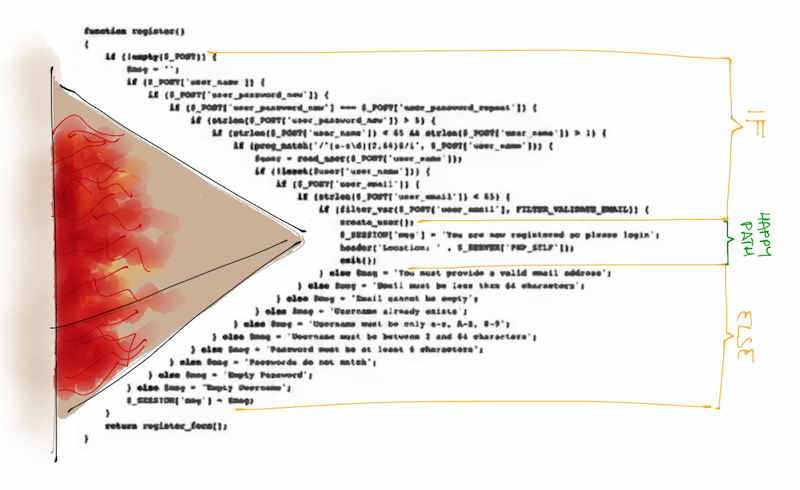

+++ {"slideshow": {"slide_type": "slide"}}

Licence CC BY-NC-ND, Thierry Parmentelat

+++ {"slideshow": {"slide_type": ""}}

# JavaScript asynchronous behaviour

```{code-cell}
tools = require('../js/tools'); tools.init({init_script: false})
```

<div class="note">

for various technical reasons, running asynchronous JS code is sometimes outside of the comfort zone for a Jupyter notebook environment
    
if things do run run smoothly from within Jupyter, and/or if you are reading this in static HTML format, you may want to copy-paste the code and run it in **right in your browser console** instead

</div>

+++ {"slideshow": {"slide_type": "slide"}}

##  summarize why

* remember that fetching data from the Internet is slow (see intro)
* not wasting time to wait for all components
* prefer to create content as soon as possible to hide some latency
* also, do not use a busy loop that wastes CPU cycles
* this means to **fetch** resources **concurrently** whenever possible
* and so to **run** code **concurrently** whenever possible

+++ {"slideshow": {"slide_type": "slide"}}

## page loading issue

* the issue is due to the fact that in most cases, code **order matters**
* for instance your code cannot spot an element in the DOM if it was not yet created
* you cannot use a given JavaScript library if its code has not finished loading
* ...
* dependency may be very tricky, and can end in a dependency loop  
  as in *`a` requires `b` that requires `a`*

+++ {"slideshow": {"slide_type": "slide"}}

## networking from JS

* the naive paradigm is: the browser sends a request to the server, and displays the result
* this is not good enough ! - consider the case of pagination in an e-commerce website
  * if we had only that approach, would bring to permanent page changes (harsh pagination)
* the client (JS side) needs to be able to sends its own http requests (+)
  * and to receive results not as HTML, but as pure data (typically JSON, XML in the old days..)
* so it can change the page content without reloading an entire page (soft pagination)
  * same thing for example to get information about the basket
* this is [where the fetch() API](https://developer.mozilla.org/en-US/docs/Web/API/Fetch_API) comes in
* see also: the TP on xkcd where we will practise this thoroughly

<div class=note>
    
(+) typically the browser sends back API calls to its server over HTTP

</div>

+++ {"slideshow": {"slide_type": "slide"}}

## general issue

* the code can become the *callback hell* by cascading callbacks
* refer to the example on catching key and mouse events  
  observe how a set of **linear** tasks  
  (load page, arm callbacks, trigger callbacks)  
  results in **nested** callbacks

* to mitigate the issue there are 2 tools
  * promise
  * `async`/`await`

+++ {"slideshow": {"slide_type": "slide"}}

## promises - what for

+++

an alternative to callbacks (since ES2015) that tries to address  
the issues known as either

* the 'Callback Hell'
  

+++ {"slideshow": {"slide_type": "slide"}}

* also known as the 'Pyramid of Doom'
  

i.e. a programming technique where an essentially **sequential** business  
ends up creating a **deeply nested** program structure

+++ {"slideshow": {"slide_type": "slide"}}

## example with `fetch()`

```{code-cell}
---
slideshow:
  slide_type: ''
---
// let us start with defining a few URLs

// an invalid URL
URL_broken = 'http://some-invalid/web/site'

// a valid small DNA sample (60 kb)
URL_small = 'https://www.ebi.ac.uk/ena/browser/api/embl/AE000789?download=true'

// valid too, but larger (10 Mb)
URL_large = 'https://www.ebi.ac.uk/ena/browser/api/embl/CP010053?download=true'
```

+++ {"slideshow": {"slide_type": "slide"}}

### fetching (1)

```{code-cell}
---
slideshow:
  slide_type: ''
---
// fetching a URL would typically be done like this

fetch(URL_small)
    .then((response) => console.log("DONE"))
```

+++ {"slideshow": {"slide_type": ""}}

as you can see, this causes 2 things:

* a `Promise` object gets printed
* a little while later, we get the `DONE` message

next, we'll redo it with a larger file,  
that takes a longer time, to get a better understanding

+++ {"slideshow": {"slide_type": "slide"}}

### fetching (2)

let's kind of zoom in, and redo the same with a larger URL that will take more time

run all 3 following cells in a row, and observe that:

* the http request is sort of "running on its own"  
* during all the time it takes to fetch the data, we can still run code !

```{code-cell}
// fetching a URL would typically be done like this

promise = fetch(URL_large)
    .then((response) => console.log("DONE"))
```

```{code-cell}
// proceed to running these immediately
console.log("I am still alive")
```

```{code-cell}
10 * 2000
```

+++ {"slideshow": {"slide_type": "slide"}}

## promises

+++

in the example above, the result of `fetch()` is a **promise**

creating a promise is like starting a separate task:  
the interpreter will go on its work in parallel with that task !

it is always possible to know the status of a promise (more on that below)  
but in general it is enough to use `.then` to specify what should happen next  
(i.e. when the promise is complete)

let us see that in more detail now

+++ {"slideshow": {"slide_type": "slide"}}

### `.then()`

+++

here's the gist of how to use promises

* you typically use a library function that returns a promise - e.g. `fetch()`
* you can invoke `.then()` on this promise object to program what should happen next
  ```js
  promise.then(function_ok, function_ko)
  ```

* where

  * `function_ok` is triggered if "all goes well"
  * `function_ko` is triggered otherwise  
    note that this **second argument is optional**

* `function_ok` is a function that consumes the output of the promise  
  (once it is complete) and produces (returns) the output of the `.then()` call  

* the `.then()` expression also returns .. a promise
  whose result is the result of `function_ok`

+++ {"slideshow": {"slide_type": "slide"}}

### `.then().then()`

+++

all this allows for *chaining*, like e.g.

```{code-cell}
:cell_style: split

// the easiest way to create a promise
// (it takes no time and always succeed)
Promise.resolve(5)
   .then(res => res * 2)
   .then(res => res * 2)
   .then(res => res * 2)
   .then(res => res * 2)
```

+++ {"cell_style": "split"}


+++ {"slideshow": {"slide_type": "slide"}}

### pending, fulfilled, or rejected

+++

* running the promise usually takes some time  
  otherwise no need for promises, right ?

* upon creation the promise is set is state ***`pending`***
* the event loop will make it progress behind the scene
* and it can either end well, in which case its state becomes ***`fulfilled`***
* or it can fail, and its state becomes ***`rejected`***

however there is **no need to bother about that** in your code  
since that is exactly what `then()` will manage for you

+++ {"slideshow": {"slide_type": "slide"}}

## going further

+++

we need to be able to do something with what the server is sending us

so as a first step (still not perfect, but a bit better) let us now see how to **display the size** of the returned content (remember, this is not a HTML document, actually it is some sort of bioinformatics ad-hoc standard...)


<div class=note>
    
again it may make sense to run the code below in a browser console rather than in a notebook environment
    
</div>

```{code-cell}
:hide_input: true

// this is a magic recipe to import fetch
// useful **ONLY** if you're using node.js


// it will even likely fail in the browser, 
// so let's do the import only if needed
try {
    fetch()
} catch {
    // what did I tell you about loading JS modules ?
    /*const*/ fetch = (...args) => import('node-fetch').then(({default: fetch}) => fetch(...args))
}
```

```{code-cell}
---
slideshow:
  slide_type: ''
---
// just in case
URL_broken = 'http://some-invalid/web/site'
URL_small = 'https://www.ebi.ac.uk/ena/browser/api/embl/AE000789?download=true'
URL_large = 'https://www.ebi.ac.uk/ena/browser/api/embl/CP010053?download=true'
```

+++ {"slideshow": {"slide_type": "slide"}}

### without error management

```{code-cell}
---
slideshow:
  slide_type: ''
---
// first iteration: we display
// - the HTTP return code (digression: google for 'http return codes')
// - the size of the response payload

function get_url1(url) {
    // hope for the best (no error handling)
    let promise = fetch(url)
        .then(response => {
            // display http head info
            console.log(`${response.url} returned ${response.status}`)
            // actually get the contents
            // and pass it to next stage
            return response.text()
        })
        .then(text => {
            console.log(`${url} page contains ${text.length} bytes`)
            return text.length
        })
    return promise
}
```

+++ {"slideshow": {"slide_type": "slide"}}

let us observe this code running with a valid URL, and then an invalid URL

```{code-cell}
---
cell_style: split
slideshow:
  slide_type: ''
---
// a valid URL

// observe how the console
// remains responsive
p = get_url1(URL_large)

// right at the start
// the promise is pending
console.log(p)

// and the repl is not hanging
200 * 200

// wait a bit, and show p again
// it is <fullfilled>
```

```{code-cell}
:cell_style: split

// an invalid URL

// in this first rough version
// error management is missing
// so the promise ends up rejected
// and this raises an exception
p = get_url1(URL_broken)

```

```{code-cell}
:cell_style: split

// if you waited a bit, and show p again
// you would see it as <rejected>
// p
```

+++ {"slideshow": {"slide_type": "slide"}}

### `.catch()`

+++

* the `catch()` method on a promise allows to deal with errors
* it applies on a promise
* a common pattern is to apply it **to the last `.then()` in the chain**
* this way, any error occurring **at any stage** in the chain gets captured
* `catch(failureCallback)` is short for `then(null, failureCallback)`

+++ {"slideshow": {"slide_type": "slide"}}

### with error management

+++

```js

// let us add error management in our get_url function

function get_url2(url) {
    // adding a catch at the end
    let promise = fetch(url)
        .then(response => {
            console.log(`${response.url} returned ${response.status}`)
            return response.text()
        })
        .then(text => console.log(`actual page contains ${text.length} bytes`))
        // this catch will deal with any error in the upstream chain
        .catch(err => console.log(`OOPS with ${url}`, err))
        // the show must go on
        .then(() => console.log('the end') )
    return promise
}
```

+++ {"slideshow": {"slide_type": "slide"}}

### `.catch()` recalls exception handling

+++ {"slideshow": {"slide_type": ""}}

* let us run this code with an invalid URL
* note that the error occurs in the `fetch()` call itself
* and not in any of the 2 `.then()`
* still, the error gets captured at the end of the chain
* this recalls the way exceptions bubble up to find a `catch` statement

+++ {"cell_style": "center"}

```js
// no exception occurs on an invalis call
get_url2(URL_broken)
```

+++ {"slideshow": {"slide_type": "slide"}}

## no more pyramid of doom

+++

with this model, we can now avoid the pyramid of doom, using chaining

```{code-cell}
:cell_style: split

// which means that this code
//  (not runnable of course)

// doSomething(function(result) {
//   doSomethingElse(result, function(newResult) {
//     doThirdThing(newResult, function(finalResult) {
//       console.log(`final result ${finalResult}`)
//     }, failureCallback)
//   }, failureCallback)
// }, failureCallback)
```

```{code-cell}
:cell_style: split

// becomes this

// doSomething()
// .then(function(result) {
//   return doSomethingElse(result)
// })
// .then(function(newResult) {
//   return doThirdThing(newResult)
// })
// .then(function(finalResult) {
//   console.log(`final result ${finalResult}`)
// })
// .catch(failureCallback)
```

<div class=note>
    
observe that 

* first form: the callback form is nested
* second form: he chained form is linear, which reflects the actual workflow here
    
</div>

+++ {"slideshow": {"slide_type": "slide"}}

## `async` / `await`

### the `await` keyword

+++

* the `await` keyword allows to wait for **the result** of a promise
* `await` can only be used inside an `async` function  
  and so it cannot be used in the global scope

+++ {"slideshow": {"slide_type": "slide"}}

### `async` functions

+++

with `async` (since ES2017) we can create a function that returns a `Promise` by default

```{code-cell}
// let us admit that (see below for the details)
// this function returns a promise that takes s seconds to complete
/*const*/ sleep = (s) => new Promise(resolve => setTimeout(resolve, 1000*s))

// as it is async, this function returns a promise
// even though we do not explicitly create one

waitInverse = async (n) => {
    if (n > 0) {
        await sleep(n)
        return 1/n
    } else {
        throw new Error(`can't stand negative numbers`)
    }
}
```

<div class="note">

the old-style syntax would read
```js
async function waitInverse(n) {...}
```

</div>

+++ {"slideshow": {"slide_type": "slide"}}

because it is a sync function, it returns a promise (no need to create one ourselves)

```{code-cell}
:cell_style: split

waitInverse(2)
  .then((result) => console.log(result))
```

```{code-cell}
:cell_style: split

// and any exception thrown will result
// in the promise ending up 'rejected'
waitInverse(-3)
```

+++ {"slideshow": {"slide_type": "slide"}}

### `async` + `await`

+++

our first attempts with `.then()` (the 2 variants of `get_url`)   
can be made much simpler thanks to this syntax

so here's yet another version of `get_url` which uses `async` / `await`  
along with more convential syntax, to achieve (almost) the same as `get_url2`  
this time we return the plain text

```js
/*const*/ get_url = async (url) => {
    try {
        response = await fetch(url)
        console.log(`status=${response.status}`)
        text = await response.text()
        console.log(`length=${text.length}`)
        return text
    } catch(err) {
        console.log(`OOPS with url=${url}`, err)
    }
}
```

+++

and it can be called like this 

<div class=note>

again you need to run this in your browser console; the notebook won't let you use `await` outside of an `async` function
    
</div>

```js
// the addition will we done after the text shows up eventually
url = URL_large
console.log(`the beginning of ${url} reads`)
//          ↓↓↓↓↓↓↓↓↓↓↓↓↓↓↓↓↓↓↓↓  ← this is a text object 
console.log((await get_url(url)).slice(0, 20) + '...')
10 + 30
```

+++ {"slideshow": {"slide_type": "slide"}}

## see also

this is just an overview, refer to

* <https://javascript.info/promise-basics> for a more thorough description of promises
* also [this article on MDN](https://developer.mozilla.org/en-US/docs/Web/JavaScript/Guide/Using_promises) can come in handy about promises too
* and <https://javascript.info/async-await> about `async/await`

+++

***

+++ {"slideshow": {"slide_type": "slide"}, "tags": ["level_advanced"]}

## optional (advanced) features

+++ {"slideshow": {"slide_type": "slide"}, "tags": ["level_advanced"]}

### promises run as coroutines

+++ {"tags": ["level_advanced"]}

* more interestingly, let us observe what happens  
  if we create several promises at the same time

* remember that promise creation returns *immediately*  
  (we've seen the repl working right after we had created our promise earlier)

* for example here is how we could fetch these 3 URLS **simultaneously**
* that's the main point of promises

+++ {"cell_style": "center", "tags": ["level_advanced"]}

```js
// more interesting:
// let us call get_url2 on the 3 URLS
// **at the same time**
for (let url of [URL_broken, URL_small, URL_large])
    get_url2(url)
```

+++ {"slideshow": {"slide_type": "slide"}, "tags": ["level_advanced"]}

### `Promise.all()`

+++ {"tags": ["level_advanced"]}

* more to the point, when running several things in parallel like this,  
  we may need to retrieve their results

* that is the point of `Promise.all()` - [and similar](https://developer.mozilla.org/en-US/docs/Web/JavaScript/Reference/Global_Objects/Promise#static_methods)
* that create a promise from a collection of promises
* and wait for some/all of them to complete

+++ {"cell_style": "center", "tags": ["level_advanced"]}

```js
// here we use again get_url1
// because it actually returns the URL size

promises = [
   get_url2(URL_broken), get_url2(URL_small), get_url2(URL_large)
]

Promise.allSettled(promises)
    .then((results) => {
          console.log(`all ${results.length} jobs are done - storing in 'contents'`) 
          contents = results
         })
```

+++ {"slideshow": {"slide_type": "slide"}, "tags": ["level_advanced"]}

### creating a promise manually

+++ {"tags": ["level_advanced"]}

* a promise can be created manually
* from a function (the executor)
* that accepts two functions in parameter  
  traditionnally called `resolve` and `reject`

* the executor calls these functions to choose  
  the result of the promise (fullfilled or rejected, resp.)

+++ {"tags": ["level_advanced"]}

```js
// a function that creates a promise that will take
// one second to compute the inverse of a number
/*const*/ delayedInverseManual = (n) => {
    return new Promise(
        // executor is a function of 2 functions
        (resolve, reject) => {
          if (n!=0)
            setTimeout(() => resolve(1/n), 1000)
          else
            reject(new Error("Cannot divide by 0"))
        })
}
```

+++ {"slideshow": {"slide_type": "slide"}, "tags": ["level_advanced"]}

### ...and calling it

+++ {"cell_style": "center", "tags": ["level_advanced"]}

```js
// you might now call it with a "then".
delayedInverseManual(4).then((result) => console.log(result))
// will print to the console 16 after 1 sec.
// and can even be simplified
delayedInverseManual(4).then(console.log)
// and handle infinity
delayedInverseManual(0).then(console.log).catch((error) => console.log(error.message))

//In the same spirit, the best way to create a promise that just wait is
/*const*/ sleep = ms => new Promise(resolve => setTimeout(resolve, ms))
```

+++ {"tags": ["level_advanced"]}

<div class="note">

here again, there are limitations with the Jupyter environment; this time the code does run in the notebook  
but the notebook *hangs* until the promise is complete, so here again you may want to run this in a browser console

</div>

+++ {"tags": ["level_advanced"]}

### more artificial `aync` functions

+++ {"tags": ["level_advanced"]}

```js
// a function that returns a promise
// it waits for 1s, and then returns 1/n
// so that it fails if n == 0

/*const*/ delayedInverse = async (n) => {
  if (n!=0) {
    // using the function sleep defined above
    // (see next slide for await usage)
    await sleep(1000)
    // return means 'fulfilled'
    return 1/n
  }
  else {
    // throw means 'rejected'
    throw new Error("Cannot divide by 0")
  }
}
```

+++ {"cell_style": "split", "tags": ["level_advanced"]}

```js
// a successful promise
p1 = delayedInverse(2)
p1
// wait a bit to inspect p1 again
```

+++ {"cell_style": "split", "tags": ["level_advanced"]}

```js
// a rejected promise
delayedInverse(0)
// ditto
```
