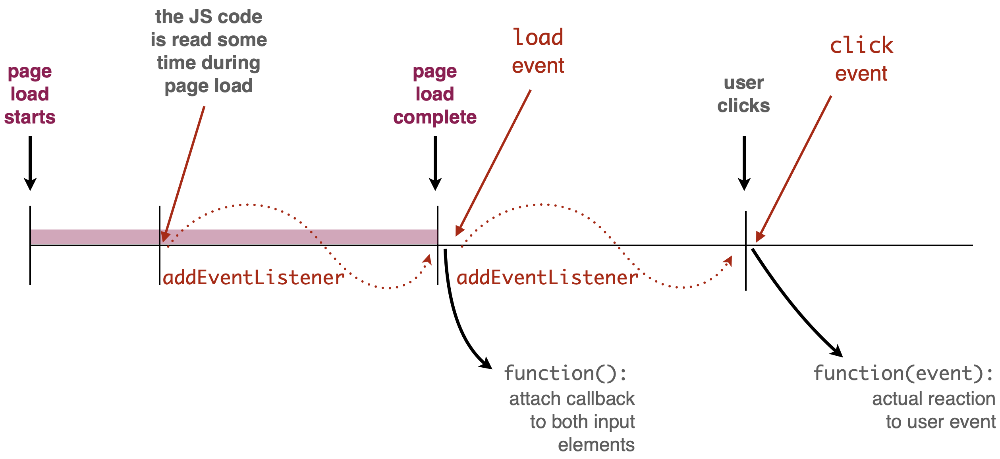

+++ {"slideshow": {"slide_type": "slide"}}

Licence CC BY-NC-ND, Thierry Parmentelat

+++ {"slideshow": {"slide_type": ""}}

# JavaScript events and callbacks

```{code-cell}
tools = require('../js/tools'); tools.init()
```

+++ {"slideshow": {"slide_type": "slide"}}

## events

* due to the specificity of the browser and the network, JavaScript within the browser is not driven like other languages
  * there is no main() function that runs forever
  * it is not either driven like a video game  
    by an infinite loop that eats all the CPU

  * instead JavaScript is driven by **events**
* events can have different natures:
  * can come from the **user activity** such as mouse click
  * can be **time-bound**
  * can be linked to **network** activity
* mostly `load` that is rather crucial
* there are also builtin events for keyboard / mouse interaction illustrated on the next example (we use `click` and `keydown`)
* for more details, see [this section in javascript.info](https://javascript.info/event-details) on all the available events
<!-- #endregion -->

+++ {"slideshow": {"slide_type": "slide"}}

## callbacks

* events are handled using callbacks,
* callbacks are functions that are called when an event occur
* to get a function to be called on a given event,  
  you have to use the `addEventListener`

for exemple, to have function `foo` called when the page is loaded, you can use the following code:

```js
// trigger once the document is loaded
window.addEventListener("load", foo)
```

* where `"load"` is the name of the event (here the end of the page load)
* and `foo` is a (variable that denotes) a *function* object

+++

<div class="note">

see also the `DOMContentLoaded` event that is subtly different
<https://developer.mozilla.org/en-US/docs/Web/API/Window/load_event>

</div>

+++ {"slideshow": {"slide_type": "slide"}}

### `addEventListener`

+++

* a fundamental tool to record a callback with an event
* available on most objects
* observe on the example how the callback **receives the event** in parameter
* and because we use `console.log(event)`  
  we have the option to inspect the event object in the console  
  and see all its attributes

+++

<div class="note">

also note that we have seen already several examples of a **callback** that was a function that **takes no parameter**  
this is one of the reasons why JS is so flexible/lenient with respect to argument passing

</div>

+++ {"slideshow": {"slide_type": "slide"}}

### events example

```{code-cell}
:hide_input: true
:tags: [hide_input]

tools.sample_from_stem("../samples/35-events-and-callbacks-01",
                       {separate_show: true, width: '40em', start_with: 'js'})
```

+++ {"slideshow": {"slide_type": "slide"}}



+++ {"slideshow": {"slide_type": "slide"}}

### example - observations

+++

notice from the example :

* how `addEventListener()` are cascaded,
* how we display the events with `console.log()`  
  this is useful technique for debugging / inspecting data

* how we inspect the event object to display meaningful data

+++ {"slideshow": {"slide_type": "slide"}}

## other types of events

### code-generated events

you can create your own event by code, e.g. :

```javascript
const event = new Event('myevent')
// Listen for the event.
elem.addEventListener('myevent', foo, false)
// Dispatch the event.
elem.dispatchEvent(event)
```

+++ {"slideshow": {"slide_type": ""}}

### time-related events

```javascript
setTimeout(foo, 3000); // call foo in 3000 ms
setInterval(foo, 3000); // call foo every 3000 ms
```

+++ {"slideshow": {"slide_type": "slide"}}

## anonymous function (a.k.a *arrow functions*)

due to the extensive use of callbacks in JavaScript, having to name every function is annoying  
for this reason, JavaScript has 2 convenient ways to create anonymous functions:

* the legacy one:

```javascript
const mylambda0 = function (arg0, arg1) { /* some code here */ }
```

* the modern one:

```javascript
const mylambda0 = (arg0, arg1) => { /* some code here */ }
```

* /!\ Both variants are valid, even if the new one looks nicer
* also, there are subtle differences, not covered here

+++ {"slideshow": {"slide_type": "slide"}}

## anonymous function usage

in this context, it is common to create functions **on the fly**, e.g.
```javascript
window.addEventListener(
    "load", 
    // the expression on the following line
    // returns a function object
    () => console.log("page loaded")  
)
```

+++ {"slideshow": {"slide_type": "slide"}}

## previous example using arrow functions

```{code-cell}
:hide_input: true
:tags: [hide_input]

tools.sample_from_stem("../samples/35-events-and-callbacks-02",
                       {separate_show: true, width: '40em', start_with: 'js'})
```

+++ {"slideshow": {"slide_type": "slide"}}

## closures

+++

* it is rather frequent that a callback needs to access data that sits **outside of the function context**
* it is safe to use lexically-bound variables inside the callback
* see the `context` variable in the example below

```{code-cell}
// here the 'context' variable is not visible

{ 
  let context = {a:1, b:2};
  setTimeout( 
    function() {
      // here the 'context' variable is visible and remain valid
      // even if we leave the block
      console.log("context is", context);
    },
    2000);
  console.log("NOW timeout armed");
} 

// here neither, let us prove it:

try {
  context
} catch(err) {
  console.log(`OOPS ${err.message}`)
}

// BUT: wait for 2s and see the callback still triggers properly
// it means that the 'context' variable is still alive 
```

+++ {"slideshow": {"slide_type": "slide"}}

### closures - continued

```{code-cell}
---
cell_style: split
slideshow:
  slide_type: ''
---
{ 
  let context = {a:1, b:2};
  setTimeout(() => console.log(context), 2000)
  console.log("armed");
}
```

+++ {"cell_style": "split"}

* `context` is created in a block
* that is **long gone** at the time the callback triggers
* but it is still reachable from the callback
* as it was *captured* in the closure

+++ {"slideshow": {"slide_type": "slide"}}

## limits of callbacks

+++

* highly recommended to study the [introduction to callbacks in javascript.info](https://javascript.info/callbacks)
* that highlights the fundamental drawback of using callbacks
* which is that you need to split your code into pieces and fit the pieces into functions
* it easily becomes hard to read and modify, especially if there is logic involved

+++

<div class="note">

again, so far we have seen a few types of events (e.g. `load`, `keydown`, `click`)

* for more details and a more exhaustive list of available events  
  see [this section in javascript.info](https://javascript.info/event-details)

</div>

+++ {"slideshow": {"slide_type": "slide"}}

## `let` *vs* `var`

+++

* take home message is: **never use `var` declarations**
* it is old-fashioned and **badly broken**
* see below
  * example with `var` in effect creates a global `i`
  * whille the one with `let` behaves as expected

```{code-cell}
:cell_style: split

function ko() {
  // DO NOT USE var IN YOUR CODE !
  for (var i=1; i<=3; i++) {
     setTimeout(() => console.log("ko", i), 
                100*i)
    }
}

ko()
```

```{code-cell}
:cell_style: split

function ok() {
  // use let instead
  for (let i=1; i<=3; i++) {
     setTimeout(() => console.log("ok", i),
                100*i)
    }
}

ok()
```

+++ {"slideshow": {"slide_type": "slide"}}

## see also

* thorough article on closures https://javascript.info/closure

+++

***
