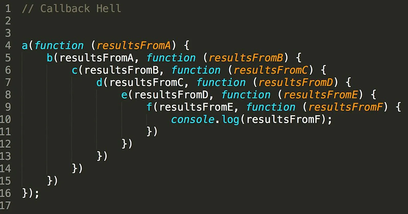
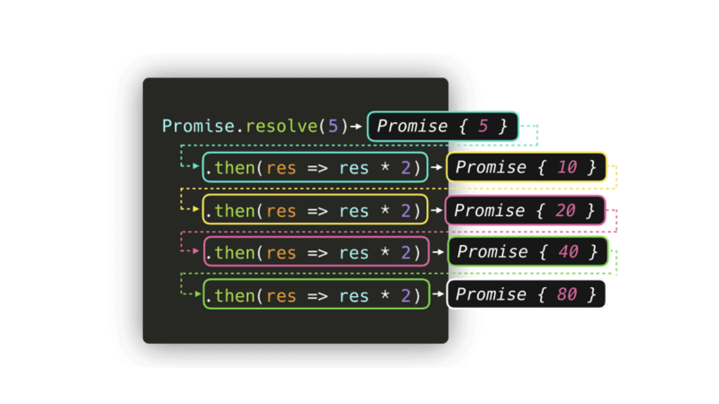

+++ {"slideshow": {"slide_type": "slide"}}

<div class="licence">
<span>Licence CC BY-NC-ND</span>
<span>Thierry Parmentelat</span>
</div>

+++ {"slideshow": {"slide_type": ""}}

# JavaScript asynchronous behaviour

```{code-cell}
delete require.cache[require.resolve('../js/toolsv3')]
tools = require('../js/toolsv3')
tools.init()
```

+++ {"slideshow": {"slide_type": "slide"}}

##  summarize why

* remember that fetching data from the Internet is slow (see intro)
* not wasting time to wait for each component
* prefer to create content as soon as possible to hide some latency
* do not use a busy loop that wastes CPU cycles
* fetch resources concurrently whenever possible
* run code concurrently whenever possible

+++ {"slideshow": {"slide_type": "slide"}}

## page loading issue

* the issue is due to the fact that in most cases, code **order matters**
* for instance you cannot get an element from code that was not yet created
* you cannot use a given JavaScript library if its code has not finished loading
* dependency may be very tricky, and can end in a dependency loop  
  as in *`a` requires `b` that requires `a`*

+++ {"slideshow": {"slide_type": "slide"}}

## general issue

* the code can become the *callback hell* by cascading callbacks
* refer to the example on catching key and mouse events  
  observe how a set of **linear** tasks  
  (load page, arm callbacks, trigger callbacks)  
  results in **nested** callbacks

* to mitigate the issue there are 2 tools
  * promise
  * `async`/`await`

+++ {"slideshow": {"slide_type": "slide"}}

## promises - what for

+++

an alternative to callbacks (since ES2015) that tries to address  
the issues known as either

* the 'Callback Hell'
  
* also known as the 'Pyramid of Doom' 
  

i.e. a programming technique where an essentially **sequential** business  
ends up creating a **deeply nested** program structure

+++ {"slideshow": {"slide_type": "slide"}}

## `.then()`

+++

here's the gist of how to use promises

* you typically use a library function that returns a promise - e.g. `fetch()`
* you can invoke `.then()` on this promise object to program what should happen next
  ```js
  promise.then(function_ok, function_ko)
  ```
* where 

  * `function_ok` is triggered if "all goes well"
  * `function_ko` is triggered otherwise  
    note that this second argument is sometimes missing
* `function_ok` is a function that consumes the output of the promise  
  (once it is complete) and produces the output of the `.then()` call  
* the `.then()` expression also returns .. a promise
  whose result is the result of `function_ok`

+++ {"slideshow": {"slide_type": "slide"}}

## `.then().then()`

+++

all this allows for *chaining*, like e.g.

```{code-cell}
:cell_style: split

// the easiest way to create a boring promise
// that always succeeds
Promise.resolve(5)
   .then(res => res * 2)
   .then(res => res * 2)
   .then(res => res * 2)
   .then(res => res * 2)
```

+++ {"cell_style": "split"}



+++ {"slideshow": {"slide_type": "slide"}}

## pending, fulfilled, or rejected

+++

* running the promise usually takes some time  
  otherwise no need for promises, right ?
* upon creation the promise is set is state ***`pending`***
* the event loop will make it progress behind the scene
* and it can either end well, in which case its state becomes ***`fulfilled`***
* or it can fail, and its state becomes ***`rejected`***

+++ {"slideshow": {"slide_type": "slide"}}

## fulfilled, rejected, example

+++

try this in a browser console (*):

+++

```js
<div class="rise-footnote">

(*) our JS code in Jupyter actually runs under a node.js kernel,
that does not have the `fetch()` function predefined  
using `fetch()` would be possible of course, but requires installing additional dependencies  
all this is out of our scope, so let's keep it simple for now, and run stuff in the browser console instead

</div>

```{code-cell}
// from within the browser this is **NOT NEEDED**
// and will even likely fail, so let's do the import
// only if needed

try {
    fetch()
} catch {
    // what did I tell you about loading JS modules ?
    /*const*/ fetch = (...args) => import('node-fetch').then(({default: fetch}) => fetch(...args))
}
```

```{code-cell}
// an invalid URL
URL_broken = 'http://some-invalid/web/site'
// a valid small DNA sample (60 kb)
URL_small = 'https://www.ebi.ac.uk/ena/browser/api/embl/AE000789?download=true'
// valid too, but larger (10 Mb)
URL_large = 'https://www.ebi.ac.uk/ena/browser/api/embl/CP010053?download=true'
```

```{code-cell}
---
slideshow:
  slide_type: slide
---
function get_url1(url) {
    // hope for the best (no error handling)
    let promise = fetch(url)
        .then(response => {
            // display http head info
            console.log(`${response.url} returned ${response.status}`)
            // actually get the contents
            // and pass it to next stage
            return response.text()
        })
        .then(text => {
            console.log(`${url} page contains ${text.length} bytes`)
            return text.length
        })
    return promise
}
```

+++ {"slideshow": {"slide_type": "slide"}}

let us observe this code running with a valid URL, and then an invalid URL

```{code-cell}
---
cell_style: split
slideshow:
  slide_type: ''
---
// a valid URL

// observe how the console
// remains responsive
p = get_url1(URL_large)

// right at the start
// the promise is pending
console.log(p)

// and the repl is not hanging
200 * 200

// wait a bit, and show p again
// it is <fullfilled>
```

+++ {"cell_style": "split"}

```js
// an invalid URL

// in this first rough version
// error management is missing
// so the promise ends up rejected
// and this raises an exception
p = get_url1(URL0)
// wait a bit, and show p again
// it is <rejected>
```

+++ {"slideshow": {"slide_type": "slide"}}

## `.catch()`

+++

* the `catch()` method on a promise allows to deal with errors
* it applies on a promise
* a common pattern is to apply it **to the last `.then()` in the chain**
* this way, any error occurring **at any stage** in the chain gets captured
* `catch(failureCallback)` is short for `then(null, failureCallback)`

+++ {"slideshow": {"slide_type": "slide"}}

let us add a `.catch()` in our `get_url` function

+++

```js
function get_url2(url) {
    // adding a catch at the end
    let promise = fetch(url)
        .then(response => {
            console.log(`${response.url} returned ${response.status}`)
            return response.text()
        })
        .then(text => console.log(`actual page contains ${text.length} bytes`))
        // this catch will deal with any error in the upstream chain
        .catch(err => console.log(`OOPS`, err))
        // the show must go on
        .then(() => console.log('the end') )
    return promise
}
```

+++ {"slideshow": {"slide_type": "slide"}}

## `.catch()` recalls exception handling

+++ {"slideshow": {"slide_type": ""}}

* let us run this code with an invalid URL
* note that the error occurs in the `fetch()` call itself
* and not in any of the 2 `.then()`
* still, the error gets captured at the end of the chain
* this recalls the way exceptions bubble up to find a `catch` statement

+++ {"cell_style": "center"}

```js
// no exception occurs on an invalis call
get_url2(URL_broken)
```

+++ {"slideshow": {"slide_type": "slide"}}

## chaining

+++

with this model, we can now avoid the pyramid of doom, using chaining

```{code-cell}
:cell_style: split

// which means that this code
//  (not runnable of course)

// doSomething(function(result) {
//   doSomethingElse(result, function(newResult) {
//     doThirdThing(newResult, function(finalResult) {
//       console.log(`final result ${finalResult}`)
//     }, failureCallback)
//   }, failureCallback)
// }, failureCallback)
```

```{code-cell}
:cell_style: split

// becomes this

// doSomething()
// .then(function(result) {
//   return doSomethingElse(result)
// })
// .then(function(newResult) {
//   return doThirdThing(newResult)
// })
// .then(function(finalResult) {
//   console.log(`final result ${finalResult}`)
// })
// .catch(failureCallback)
```

observe that the chained form is linear, which reflects the actual workflow here

+++ {"slideshow": {"slide_type": "slide"}}

## promises run as coroutines

+++

* more interestingly, let us observe what happens  
  if we create several promises at the same time
* remember that promise creation returns *immediately*  
  (we've seen the repl working right after we had created our promise earlier)
* for example here is how we could fetch these 3 URLS **simultaneously**
* that's the main point of promises

+++ {"cell_style": "center"}

```js
// more interesting:
// let us call get_url2 on the 3 URLS
// **at the same time**
for (let url of [URL_broken, URL_small, URL_large])
    get_url2(url)
```

+++ {"slideshow": {"slide_type": "slide"}}

## `Promise.all()`

+++

* more to the point, when running several things in parallel like this,  
  we may need to retrieve their results
* that is the point of `Promise.all()` - [and similar](https://developer.mozilla.org/en-US/docs/Web/JavaScript/Reference/Global_Objects/Promise#static_methods)
* that create a promise from a collection of promises
* and wait for some/all of them to complete

+++ {"cell_style": "center"}

```js
// here we use again get_url1
// because it actually returns the URL size

Promise.allSettled([URL_broken, URL_small, URL_large].map(get_url1))
    .then(console.log)
```

+++ {"slideshow": {"slide_type": "slide"}}

## creating a promise manually

+++

* a promise can be created manually
* from a function (the executor)
* that accepts two functions in parameter  
  traditionnally called `resolve` and `reject`
* the executor calls these functions to choose  
  the result of the promise (fullfilled or rejected, resp.)

+++

```js
// a function that creates a promise that will take
// one second to compute the inverse of a number
/*const*/ delayedSafeInverse = (n) => {
    return new Promise(
        // executor is a function of 2 functions
        (resolve, reject) => {
          if (n!=0)
            setTimeout(() => resolve(1/n), 1000)
          else
            reject(new Error("Cannot divide by 0"))
        })
}
```

+++ {"slideshow": {"slide_type": "slide"}}

## ...and calling it

+++ {"cell_style": "center"}

```js
// you might now call it with a "then".
delayedSafeInverse(4).then((result) => console.log(result))
// will print to the console 16 after 1 sec.
// and can even be simplified
delayedSafeInverse(4).then(console.log)
// and handle infinity
delayedSafeInverse(0).then(console.log).catch((error) => console.log(error.message))

//In the same spirit, the best way to create a promise that just wait is
/*const*/ sleep = ms => new Promise(resolve => setTimeout(resolve, ms))
```

+++

<div class="rise-footnote">

here again, there are limitations with the Jupyter environment; this time the code does run in the notebook  
but the notebook *hangs* until the promise is complete, so here again you may want to run this in a browser console

</div>

+++ {"slideshow": {"slide_type": "slide"}}

## `async` keyword

+++

with `async` (since ES2017) we can create a function that returns a `Promise` by default

+++

```js
// another way to create a function that returns
// the same promise
/*const*/ delayedSafeInverseAsync = async (n) => {
  if (n!=0) {
    // using the function sleep defined above
    // (see next slide for await usage)
    await sleep(1000)
    // return means 'fulfilled'
    return 1/n
  }
  else {
    // throw means 'rejected'
    throw new Error("Cannot divide by 0")
  }
}
```

+++ {"cell_style": "split"}

```js
// a successful promise
p1 = delayedSafeInverseAsync(2)
p1
// wait a bit to inspect p1 again
```

+++ {"cell_style": "split"}

```js
// a rejected promise
delayedSafeInverseAsync(0)
// ditto
```

+++

<div class="rise-footnote">

the old-style syntax would read
```js
async function succeed_or_fail(ms, success, what) {...}
```

</div>

+++ {"slideshow": {"slide_type": "slide"}}

## `await` keyword

+++

* the `await` keyword allows to **wait for** the result of a promise
* `await` can only be used inside an `async` function  
  and so it cannot be used in the global scope

* question: why is that even needed ?
* answer: what would happen in `succeed_or_fail` if we remove the `await` ?  
  *hint*: remember that promise are created immediately !

+++ {"slideshow": {"slide_type": "slide"}}

## see also

this is just an overview, refer to
* <https://javascript.info/promise-basics> for a more thorough description of promises
* also [this article on MDN](https://developer.mozilla.org/en-US/docs/Web/JavaScript/Guide/Using_promises) can come in handy about promises too
* and <https://javascript.info/async-await> about `async/await`

+++

***
