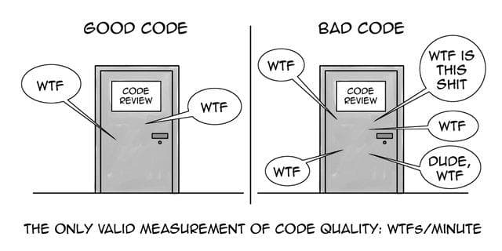

Licence CC BY-NC-ND, Thierry Parmentelat


# simple React apps

in this notebook we will see 2 small React apps

* one that is a toy really, that show 2 counters; each counter has a pair of
  buttons + / - to modify the counter

* another a little more elaborate, that implements a calculator

there is also a looooong list of examples here <https://reactjsexample.com>

# app #1: the dual-counters app

the git repo for this app is <https://github.com/ue22-p22/web-react-counters>

## your assignment

**Note:** read the section '**app #1: the dual counters app**' section entirely before you start anything

* clone the repo
* get it to work in your laptop
* add a third counter with a label of your choice  
  and observe how the notion of component makes this task much easier than with
  the html/css/js paradigm

## what you'll need to know : getting started

the simplest way to get started is

<details open><summary>you will need nodejs installed</summary>

  * you can for example leverage `conda` for that
    ```shell
    # react-calc is just one arbitrary name
    conda create -n react-calc -c conda-forge nodejs
    conda activate react-calc
    ```

  * this will give you the `node` and the `npm` commands
    ```shell
    # to check that you're all set
    node --version
    npm --version
    ```

  </details>

<details open><summary>clone the repo, and `cd` in there</summary>

  * *you know how to do this, right ?*

  </details>

<details open><summary>install the dependencies</summary>

  * you need to run this only once, of course
    ```shell
    npm install
    ```
    which will fetch a whole bunch of libraries in the `node_modules` folder (expect several hundreds of MB..)

  </details>

<details open><summary>start the development server</summary>

  * to run the app in devel mode
    ```shell
    npm start
    ```
  </details>

<br>
at that point you should have the application running in your browser (and executing in your laptop)

be aware that the `npm start` command will not return: it keeps monitoring
changes made to the files on the disk, and will trigger any recompilation
needed; bottom line is, you just need to save changes in vs-code, and the app
reflects them immediately, not need to reload the page nor anything !

## what you'll need to know: the framework

the files of interest are mostly these (the other ones are just boilerplate that
come with the project when you create it)
```
./public/
  index.html
./src/
  index.js         <- the main entry point  in JSX
  index.css        <- related style sheet   in CSS
  App.js           <- creates 2 Counters    in JSX
  App.css          <- related style sheet   in CSS
  components/
    Counter.js     <- Counter component     in JSX
    Counter.css    <- related style sheet   in CSS
    Button.js      <- Button component      in JSX
    Button.css     <- related style sheet   in CSS
```

but wait, take a closer look, there's a large number of wtf's waiting for you
(remember the best measurement of code quality is expressed in wtf/mn ;)



but seriously though, here are some points of astonishment, as compared to what
you might expect wrt html/css/js, that deserve to be outlined:

### no need to reload

that's already a plus, as compared with the traditional page setup: just save
your changes, and you see them right away; for people who code all day long,
that is genuine relief !

### the HTML is irrelevant

there is no html file; or rather, there's just one in `public/index.html` and if
you look into it, it's vastly empty; actually, the html skeleton is entirely
built from the js code, so there's no need for html

### not quite JS, but JSX

The biggest surprises are in the JS code, which is actually written in so-called
JSX; think of it as a preprocessor that will do a pass on the contents and
create a plain JavaScript file from that.

Let us start with a quick reading of the quick intro that is here <https://reactjs.org/docs/introducing-jsx.html>

Then look at the 2 .js files in the repo; I am sure you can guess what they do !
You should notice at least things like

* the way to import css right from the js side:
  ```js
  // explicit import of css
  import './App.css'
  ```

* how JSX allows to mix HTML in the js side:
  ```js
  // some sort of mix between JS and HTML
  return (
    <div class="toplevel">
      <Counter text="temperature" />
      <Counter text="pressure"  />
    </div>
  )
  ```

* also the notion of **components** is at work in the above fragment; here the
  `<Counter>` thing denotes a piece of the app defined in another js file; that
  makes the code written in this paradigm much more reusable

* and of course a component can refer to other components, like here
  ```js
  // here we have a mix of actual HTML tags (in lowercase)
  // and of components tags(Button, in CamelCase)
  return (
      <div class="counter">
        <span>{text} ({counter})</span>
        <div class="buttons">
          <Button text="-" type="decrease" onClick={decreaseCounter} />
           {/* here {counter} is automatically updated
               each time we call setCounter */}
          <span class="value">{counter}</span>
          <Button text="+" type="increase" onClick={increaseCounter} />
        </div>
      </div>
    )
  ```

### sharing data with `useState`

you can also notice in the code how JS variables can be used right in the HTML
section when mentioned between `{}`, like in the fragment just above

so another very useful feature of React is `useState`; this line
```js
tools = require('../js/tools'); tools.init()
```

```js
const [counter, setCounter] = useState(0)
```
declares 2 JS variables:

* the first one `counter` being a storage variable (here initialized to 0),
* and the second one `setCounter` being the function to use for modifying this variable

and the magic here being that each time this function is called, all the places
where it is used in the DOM will be updated; and indeed when e.g. the
`increaseCounter` callback is called, you can see in the app the counter being
updated in 2 separate locations, with one single call to `setCounter`.

not only this is powerful, but it also efficient (under the hood React maintains
a so-called virtual DOM, that allows it to compute the changes in memory, so it
can only update the parts that need to be; but that's another story entirely)


# app #2: a calculator

about this app:

* [the presentation page](https://reactjsexample.com/simple-but-well-styled-calculator-made-by-using-hooks/)
* the related git repo is here
  <https://github.com/ue22-p22/web-react-calculator>
  which I actually forked from
  <https://github.com/vasilykhromykh/React-Calculator-With-React-Hooks>
  with purely cosmetic changes

* you can also [check out the live demo](https://vasilykhromykh.github.io/React-Calculator-With-React-Hooks/)

## your assignment

* clone the repo
* get it to work on your laptop (see above)
* implement a new feature
  * for example: add a (global) 'Clear' button that is missing  
    (as the backspace-like icon only clears one character in the expression)

  * or add more operations like // and %
  * or whatever you deem interesting

## what you'll need to know: the framework

this time the code structure is a little simpler, this app does not define any
component, so the files of interest are mostly these:
```
./public/
  index.html
./src/
  App.js           <- the calculator code   in JSX
  App.sass         <- related style sheet   in Sass
  index.js         <- the main entry point  in JSX
  index.sass       <- related style sheet   in Sass
```

the new thing here is the use of SASS instead of CSS

### not CSS, but SASS

CSS is sometimes considered tedious and boring; so there are a few alternatives
around, here we've picked SASS - see <https://sass-lang.com/guide> for more
details (it could have been any other CSS preprocessor)

the most visible differences are

* there's no `{` or `}` or `;`, a bit like with Python, it's the indentation
  that is meaningful

* you can use nesting (see the 'Nesting' section in
  <https://sass-lang.com/guide>), which makes the overall presentation easier to grasp

* support for variables; it's also in plain CSS, but in the old days it was not
* and a lot more; but on the other hand, that's not the point here that much

# HOWTO start a react app from scratch

Finally, FYI assuming you'd like to write your own app, there's a tool that
creates the scaffolding for you:

### create project skeleton

this requires a network connection and may take a while...
it will also download a rather huge amount of libraries and dependencies, that go into the `node_modules` folder (close to 350 MB on my mac)

```shell
npx create-react-app react-calc
```

### run the watcher

you can then do as above:

```shell
cd react-calc
npm start
```

and, after a while again, you get a message that reads `Edit src/App.js and save
to reload.` with a spinning react logo on top: you're ready to code; try it:
change this message with vs-code (it appears in `src/App.js`) and save the file,
you will see the changes have been taken into account
